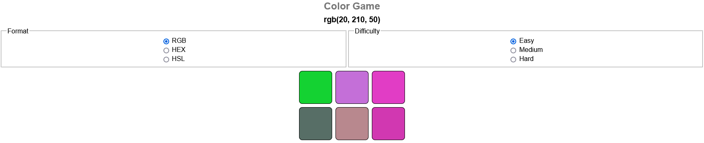

# Color Matching Game
A simple Color Matching Game built with HTML, CSS and JavaScript.

### [Play the game](https://ofcode.com.br/projects/minesweeper)

## Further help

To get more help on the Angular CLI use `ng help` or go check out the [Angular CLI README](https://github.com/angular/angular-cli/blob/master/README.md).

## Author

- Website - [Mondara](https://mondarathotage.com/)
- Linkedin - [@Mondara](https://www.linkedin.com/in/mondara-thotage/)
- Github - [@Mondara](https://github.com/Mondara)
